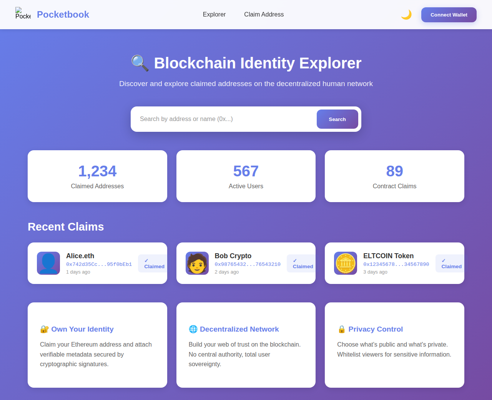
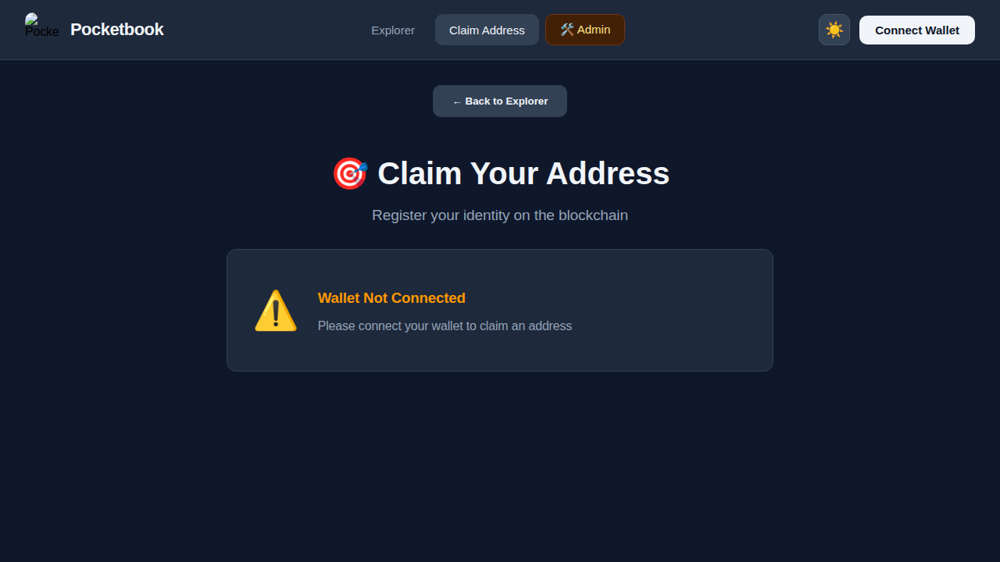

<div align="center">
  <p>
    
  </p>
  <p>
    ✨ Censorship immune, Decentralised Human Network & Identity Platform ✨
  </p>
</div>

## Overview

Pocketbook is a revolutionary decentralized identity platform that enables users to claim and verify ownership of their Ethereum addresses. Built with Svelte and Solidity, it creates a censorship-resistant human network where you have complete sovereignty over your digital identity.

### 🚀 Quick Start

```bash
npm install
npm run dev
```

Visit `http://localhost:3000` and connect your MetaMask wallet to get started!

### ✨ Features

- 🎯 **Address Claiming** - Prove ownership and attach verified metadata to any address
- 🔐 **Cryptographic Security** - All claims signed and verified on-chain
- 🆔 **DID Support** - W3C compliant Decentralized Identifiers (did:ethr) for self-sovereign identity
- 🏷️ **ENS Integration** - Use human-readable names (name.eth) instead of addresses with full ENS resolution and reverse lookup
- 🌐 **Multi-Chain Support** - Simultaneous connectivity to Ethereum, Polygon, BSC, Arbitrum, Optimism, and Avalanche
- 🔗 **Cross-Chain Identity** - View and manage claims across multiple blockchain networks
- 📦 **IPFS Storage** - Decentralized metadata storage with DID-based content routing
- 🔒 **Privacy Controls** - Choose what's public and whitelist private viewers
- 🌓 **Dark Mode** - Beautiful UI with light and dark themes
- 💼 **Contract Support** - Claim smart contract and token addresses
- 🔌 **Interoperability** - DID-based identity works across decentralized platforms
- 👥 **Social Graph** - Follow/unfollow users, send friend requests, and build your decentralized network
- 🔑 **PGP Signatures** - Add PGP signatures for additional cryptographic verification

### 📚 Documentation

See [DOCUMENTATION.md](./DOCUMENTATION.md) for comprehensive guides on:
- Architecture and design
- Smart contract deployment
- Frontend development
- Security best practices
- Contributing guidelines

See [docs/ENS_INTEGRATION.md](./docs/ENS_INTEGRATION.md) for ENS integration details:
- ENS name resolution and reverse lookup
- Supported networks and features
- API reference and usage examples

See [docs/IPFS_INTEGRATION.md](./docs/IPFS_INTEGRATION.md) for IPFS storage details:
- Decentralized metadata storage
- DID-based content routing
- Extensibility for future features
- API reference and examples

### 🏗️ Tech Stack

- **Frontend**: Svelte + Vite
- **Blockchain**: Solidity + Ethers.js
- **Crypto**: Web Crypto API for encryption

### 📸 Screenshots

#### Explorer View - Light Mode
Browse and discover claimed addresses on the decentralized network with statistics dashboard


*Full-page explorer view showing search, statistics, and recent claims*

#### Dark Mode
Night mode support for comfortable viewing



#### Claim Address Page
Register your identity on the blockchain



---

Built with ❤️ for a decentralized future
